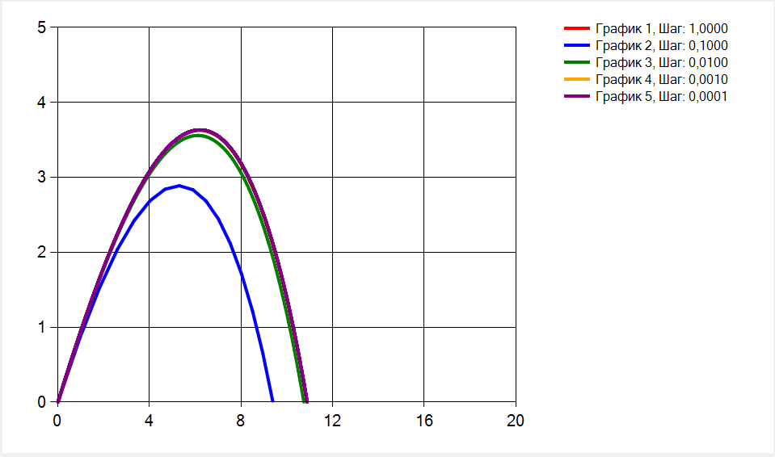

### Моделирование полёта тела в атмосфере

**Задание:**  
Реализовать приложение для моделирования полёта тела в атмосфере.  
Предусмотреть возможность ввода шага моделирования и вывода результатов.

Выполнить моделирование **без очистки предыдущих результатов** для различных шагов моделирования, сравнить траектории и заполнить таблицу:

| Шаг моделирования, с | 1 | 0.1 | 0.01 | 0.001 | 0.0001 |
|----------------------|---|-----|------|-------|--------|
| Дальность полёта, м |   |     |      |       |        |
| Максимальная высота, м | | | | | |
| Скорость в конечной точке, м/с | | | | | |

**Сделать выводы.**

**В отчёт включить:**
- код программы;
- скриншот с несколькими траекториями;
- заполненную таблицу;
- выводы.

### ОТЧЕТ

**Начальные условия:**
Высота: 0 м;

Угол: 45 градусов;

Сорость: 15 м/с;

Размер: 1,5 $м^2$;

Вес: 2 кг.

**График с  несколькими траекториями:**

**Таблица с результатами:**
| Шаг моделирования, с | 1 | 0.1 | 0.01 | 0.001 | 0.0001 |
|----------------------|---|-----|------|-------|--------|
| Дальность полёта, м | -0.938  | 9.78 | 10.778 | 10.873 | 10.885 |
| Максимальная высота, м | 0 | 2.888 | 3.558 | 3.626 | 3.663 |
| Скорость в конечной точке, м/с | 15 | 7.637 | 8.164 | 8.209 | 8.216 |

#### **Вывод:**
По результатам моделирования видно, что величина шага интегрирования существенно влияет на точность расчётов. При шаге 1 с получаются некорректные результаты (отрицательная дальность, нулевая высота), что говорит о большой численной погрешности и непригодности такого шага.

При уменьшении шага результаты становятся реалистичными и сходятся. Уже при 0,1 с траектория имеет корректный вид, а начиная с 0,01 с изменения становятся незначительными, что свидетельствует о сходимости решения.

При малых шагах дальность стабилизируется около 10,88 м, максимальная высота — около 3,66 м, а конечная скорость — примерно 8,2 м/с. Снижение скорости по сравнению с начальной подтверждает влияние сопротивления воздуха. Оптимальным можно считать шаг 0,001 с, так как дальнейшее его уменьшение почти не влияет на результат, но увеличивает вычислительные затраты.